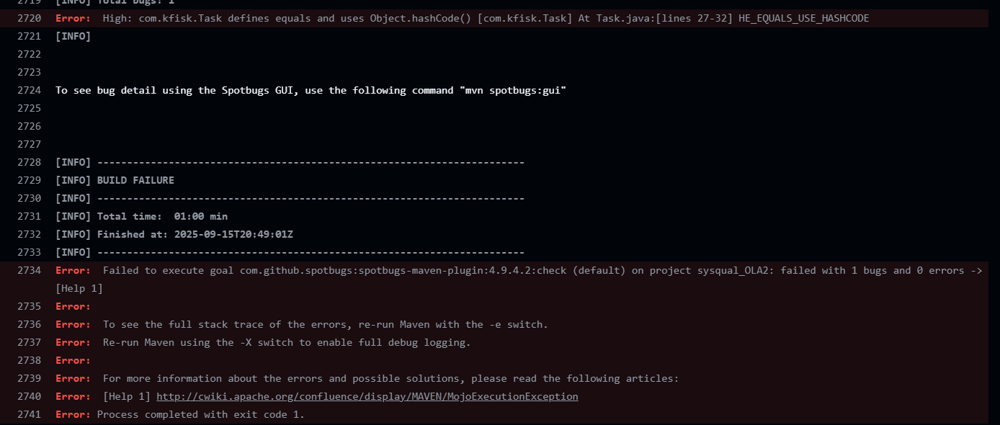
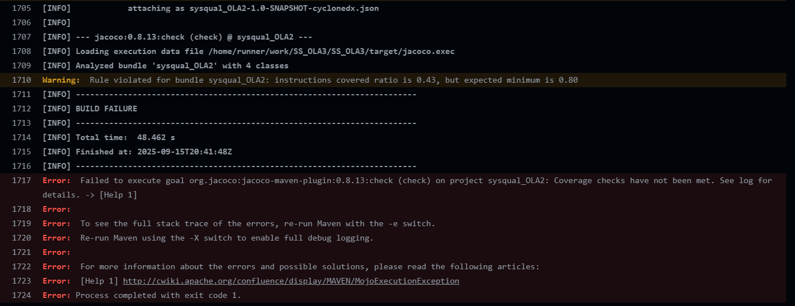
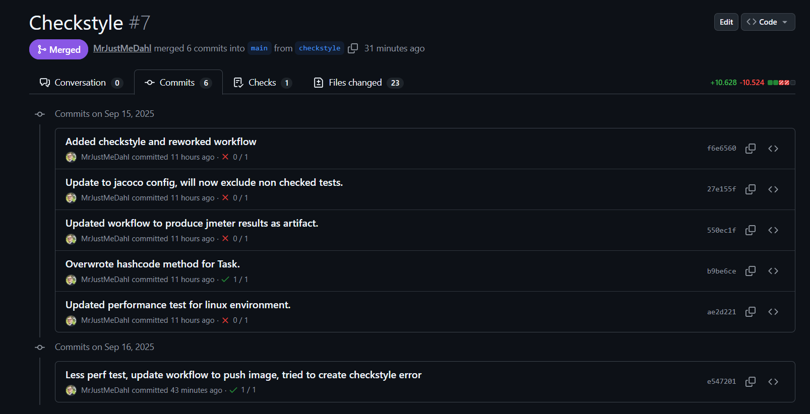

# OLA3 - UASS

### Made by

- Lasse Hansen - cph-lh479@stud.ek.dk
- Pelle Hald Vedsmand - cph-pv73@stud.ek.dk
- Nicolai Rosendahl - cph-nr135@stud.ek.dk

## Objective of assignment: 
Create an automated CI pipeline with enforce pull requests on main branch.

Our goal is to automate our test pipeline in 2 steps to ensure a healthy main branch:

- Run maven test lifecycles
- Build app docker image

Second step will only be executed on succesful test phase.

We will add our current test pipeline (unit, integration, System, code coverage and performance testing),
and add Spotbugs, stylechecking (lint) and SBOM.

Performance testing is done in a containerized environment with Docker.

We use a previous OLA we did in the Software Quality course, because it provides an example application complete with unit- integration- and system tests that are verifyable by Maven. 

## Deliverables: 

### Prototype:

All the source code and testing is found within [here](src)

### CI Pipeline - running build, tests, static analysis and test coverage:

The GitHub Actions workflow is found in the [.github/workflows](.github/workflows) folder.

The workflow is triggered by a push or pull request to the main branch, as part of the branch protection implemented. The reason for the docker image being build before the tests are run, is to ensure that the tests depending on the image, is tested against the latest version of the application.

The maven lifecycle verify is being used to run tests, along with Spotbugs, Checkstyle, SBOM generation with Cyclonedx, Jacoco code coverage and performance testing. This is to be ready for a future implementation, further separating which tests and analysis steps needs to be run on localhost vs on push to production branches.

### Make sure to make some violations that break things and watch the CI respond:

Some examples of how violations of the static analysis tools were made during development:

- Spotbugs (Set to fail build on high severity issues): An equals method was overwritten, while the hashcode method was not.

- Jacoco (Code coverage set to fail build if below 80%): We have tests made for routing and controller classes that is not counted by Jacoco, because the tests are run within a docker environment. These classes needed to be excluded from the Jacoco check, to not fail the build.

### Produce a Docker image and push it to GitHub Container Registry:
The docker image is built during the pipeline and is pushed to the GitHub Container Registry after tests and static analysis have passed.

The image is found on the GitHub repo under packages after successful push.

### Upload artifcats + SBOM: 
All artifacts including the SBOM is stored on GitHub as part of the workflow run. We used the if: always() condition to make sure that reports are always generated and uploaded even if the build fails.

You can find the artifacts for every specific workflow run under the "Artifacts" section of the run summary. The zip file holds reports from Spotbugs, Checkstyle, Jacoco, JMeter and includes the SBOM in the Cyclonedx folder.

### Enforce branch protection:

We use the main branch to reflect the applications current state. Therefore we want to keep it as healthy as possible, by restricting updates to pull requests that requires a successful test run and a a review from another collaborator before a merge.

### Demonstrate greed/red checks in PR:

Example of a pull request failing due to different violations, and later passing after new commits with fixes:

